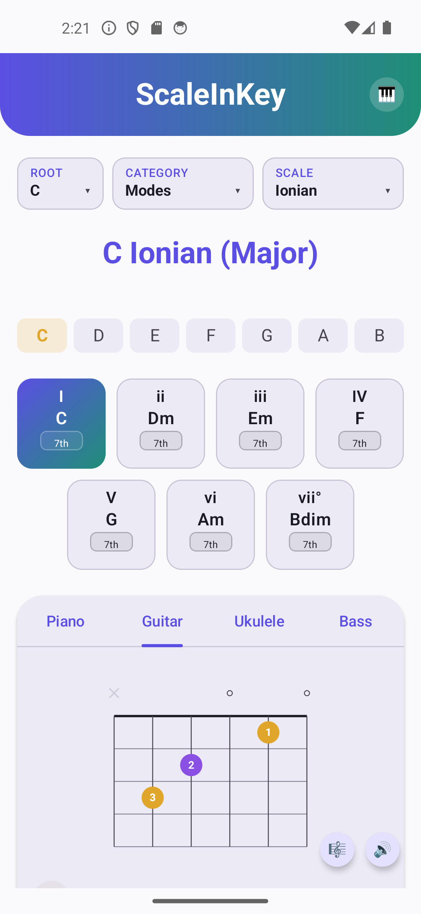
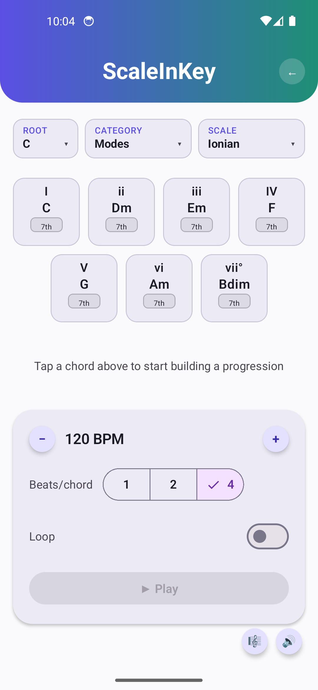

# ScaleInKey

ScaleInKey is an Android (8+) app that shows you the notes and chords in various modes and scales. 
It also includes a simple chord progression sequencer with looping and adjustable BPM.

 

## Features

- **33 scale types** across six categories — the 7 diatonic modes, Harmonic/Melodic Minor,
  five Pentatonic & Blues scales (Major/Minor Pentatonic, Major/Minor Blues, Egyptian
  Pentatonic), ten World/Exotic scales (Hungarian Minor, Byzantine, Persian, Hirajoshi, In Sen,
  Iwato, Enigmatic, Phrygian Dominant, Neapolitan Minor, Neapolitan Major), six Jazz scales
  (Altered, Lydian Dominant, Lydian Augmented, Locrian ♮2/Half-Diminished, Bebop Dominant,
  Bebop Major), and three Symmetric scales (Whole Tone, Diminished Whole-Half, Diminished
  Half-Whole) — with correct enharmonic spelling in every key.
- **Diatonic chords** for every scale that supports them, shown as triads by default with a
  per-chord toggle to the 7th-chord voicing, including the rarer harmonic/melodic-minor chord
  qualities (minor-major7, augmented-major7, fully-diminished7, half-diminished7).
- **Four instrument diagrams** — Piano, Guitar, Ukulele, Bass — highlighting the current scale or
  selected chord.
- **Fingering-chart mode** for Guitar/Ukulele/Bass: switch from the full-neck highlight view to a
  traditional chord-box diagram for the selected chord (using real, curated open-position shapes
  where one exists, and an algorithmic near-the-nut search otherwise so every chord — even
  exotic ones — still gets a playable shape), or a finger-numbered scale-position box when no
  chord is selected. Bass shows a single root-note position marker instead, since bass isn't
  played as strummed chords.
- **Tap-to-hear playback** of any note, chord, or fretboard/chord-chart position, via a real SF2
  synth (not a beeper) — bundled with a small default soundfont, with the option to load your own
  `.sf2` file. Every tap flashes a distinct highlight color so it's clear exactly what you hit.
- **Chord progression sequencer** — a separate screen (switch to it via the 🎹 icon next to the
  title) for building an ordered sequence of the current scale's diatonic chords and playing it
  back at a settable tempo: a BPM stepper (default 120), beats-per-chord, a loop toggle, tap to
  append a chord from the palette (long-press to toggle its triad/7th voicing first), and
  drag-to-reorder or tap-to-remove on chords already queued.

## Requirements

- Android Studio (recent stable) with the NDK and CMake components installed (the sound engine
  has a native C++ module).
- A JDK — this project has no system-wide `JAVA_HOME` requirement baked in, but if you're running
  Gradle from the command line rather than through Android Studio, point `JAVA_HOME` at Android
  Studio's bundled JBR, e.g.:
  ```
  export JAVA_HOME=/path/to/android-studio/jbr
  ```
- minSdk 26 / targetSdk 37.

## Building & testing

```
./gradlew assembleDebug        # build the debug APK
./gradlew testDebugUnitTest    # run the unit tests (music theory + chord-fingering logic)
```

## Architecture

- `music/` — pure-Kotlin, UI-free music theory domain model: scale/chord construction and
  spelling, chord-quality classification, instrument tunings, and the chord-fingering algorithm
  and lookup table. Extensively unit-tested, including exhaustive brute-force checks across every
  scale type, root, and degree.
- `ui/` — Jetpack Compose screens and components. Diagrams (`ui/components/diagrams/`) are
  Canvas-drawn rather than using pre-rendered assets, so they can highlight notes and label
  fingerings dynamically.
- `audio/` + `cpp/` — a custom Oboe + TinySoundFont native audio engine (`native_sound_engine.cpp`)
  for real-time SF2 playback, with a lock-free command queue so note-on/off requests from Kotlin
  never race with rendering on the audio callback thread.

## Attribution

- The bundled default soundfont (`app/src/main/assets/scaleinkey_default.sf2`) is trimmed from
  Frank Wen's **FluidR3 GM** (MIT License) — see the accompanying `.NOTICE.txt` for details.
- The native audio engine vendors **TinySoundFont** (`cpp/tsf.h`, MIT License) directly —
  see `cpp/tsf.h.NOTICE.txt`.

## License

MIT — see [LICENSE](LICENSE).
